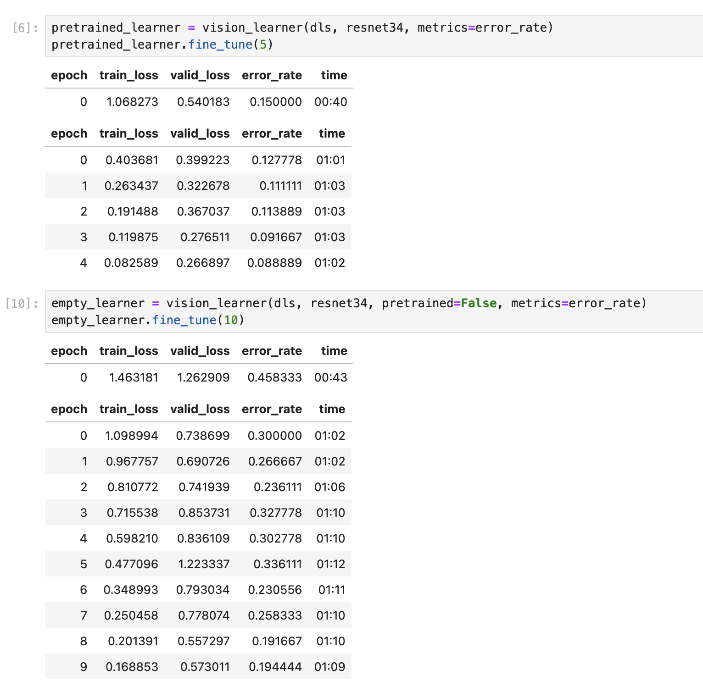

# anime-recognizer
A fastai powered Jupyter notebook to recognize anime by their artistic styles

# Anime Recognizer

This project is part of lesson 1 of the FastAI introduction to AI course. The assignment is to find a creative use for a vision or tabular deep learning model. I have decided to create an image classifier which can recognize a set of anime shows from screenshots of an episode of the show.

The goal of this project is creating a trained model that recognizes stylistic features from anime shows. This is more challenging than a simple object classification task because it must understand styles applied to new subjects as opposed to simply recognizing subjects.

## Training data
For our training data set, we will use square images taken from cropped screenshots of video files of different anime. We will write a python script that reads in video files (episodes of anime shows), seeks to 10 second increments of the video, and takes cropped screenshots from the center of the frame.

To keep training data balanced, we will create a set amout (set below to 600) screenshots for each anime.

You can see a preview of a subset of the training data below:


## Model and training
We will try two approaches with the resnet34 architecture. First, we will fine-tune a resnet34 model pre-trained on IMAGENET1K_V2. Then we will train a blank resnet34 architecture and compare the error rate of each to determine the best approach.

## Results

As you can see from the results in the screenshot below, the pretrained
model (pretrained on `IMAGENET1K_V2`) out-performed the blank model,
even when additional epochs were trained on the blank model.
This is likely due to either over-fitting on the blank model, transfer
learning with the pretrained model, or a combination of both factors.

The fine-tuned model achieved 95% accuracy after 5 epochs and the blank
model achieved 81% accuracy after 10 epochs.




## Run it yourself
To train and run this model yourself, you must aquire video files of each anime yourself. :)  You can then place the video files into appropriately named directories in the `training_data/anime_videos/` directory, e.g. `training_data/anime_videos/food_wars` or `training_data/anime_videos/blue_eyed_samurai`.

If you need inspiration to find anime video files to download, these are the ones I used:
- Blue Eye Samurai
- Food Wars
- Samurai Champloo

Blue Eye Samurai
```
magnet:?xt=urn:btih:B969C4EA12C23C57F09099D17CB107E46BC663D5&dn=Blue.Eye.Samurai.S01.COMPLETE.1080p.NF.WEB.h264-QUiNTESSENCE%5BTGx&tr=http%3A%2F%2Fp4p.arenabg.com%3A1337%2Fannounce&tr=udp%3A%2F%2F47.ip-51-68-199.eu%3A6969%2Fannounce&tr=udp%3A%2F%2F9.rarbg.me%3A2780%2Fannounce&tr=udp%3A%2F%2F9.rarbg.to%3A2710%2Fannounce&tr=udp%3A%2F%2F9.rarbg.to%3A2730%2Fannounce&tr=udp%3A%2F%2F9.rarbg.to%3A2920%2Fannounce&tr=udp%3A%2F%2Fopen.stealth.si%3A80%2Fannounce&tr=udp%3A%2F%2Fopentracker.i2p.rocks%3A6969%2Fannounce&tr=udp%3A%2F%2Ftracker.coppersurfer.tk%3A6969%2Fannounce&tr=udp%3A%2F%2Ftracker.cyberia.is%3A6969%2Fannounce&tr=udp%3A%2F%2Ftracker.dler.org%3A6969%2Fannounce&tr=udp%3A%2F%2Ftracker.internetwarriors.net%3A1337%2Fannounce&tr=udp%3A%2F%2Ftracker.leechers-paradise.org%3A6969%2Fannounce&tr=udp%3A%2F%2Ftracker.openbittorrent.com%3A6969%2Fannounce&tr=udp%3A%2F%2Ftracker.opentrackr.org%3A1337&tr=udp%3A%2F%2Ftracker.pirateparty.gr%3A6969%2Fannounce&tr=udp%3A%2F%2Ftracker.tiny-vps.com%3A6969%2Fannounce&tr=udp%3A%2F%2Ftracker.torrent.eu.org%3A451%2Fannounce
```

Food Wars:
```
magnet:?xt=urn:btih:BDB84801BE521B84A9C9F9350CE81688502D7773&dn=%5BHi10%5D_Shokugeki_no_Souma_S1_and_S2_%5BBD_720P%5D+%28Food+Wars%29&tr=http%3A%2F%2Fp4p.arenabg.com%3A1337%2Fannounce&tr=udp%3A%2F%2F47.ip-51-68-199.eu%3A6969%2Fannounce&tr=udp%3A%2F%2F9.rarbg.me%3A2780%2Fannounce&tr=udp%3A%2F%2F9.rarbg.to%3A2710%2Fannounce&tr=udp%3A%2F%2F9.rarbg.to%3A2730%2Fannounce&tr=udp%3A%2F%2F9.rarbg.to%3A2920%2Fannounce&tr=udp%3A%2F%2Fopen.stealth.si%3A80%2Fannounce&tr=udp%3A%2F%2Fopentracker.i2p.rocks%3A6969%2Fannounce&tr=udp%3A%2F%2Ftracker.coppersurfer.tk%3A6969%2Fannounce&tr=udp%3A%2F%2Ftracker.cyberia.is%3A6969%2Fannounce&tr=udp%3A%2F%2Ftracker.dler.org%3A6969%2Fannounce&tr=udp%3A%2F%2Ftracker.internetwarriors.net%3A1337%2Fannounce&tr=udp%3A%2F%2Ftracker.leechers-paradise.org%3A6969%2Fannounce&tr=udp%3A%2F%2Ftracker.openbittorrent.com%3A6969%2Fannounce&tr=udp%3A%2F%2Ftracker.opentrackr.org%3A1337&tr=udp%3A%2F%2Ftracker.pirateparty.gr%3A6969%2Fannounce&tr=udp%3A%2F%2Ftracker.tiny-vps.com%3A6969%2Fannounce&tr=udp%3A%2F%2Ftracker.torrent.eu.org%3A451%2Fannounce
```

Samurai Champloo
```
magnet:?xt=urn:btih:0692DB7EA69E6E11385C8142C9C9526B28EE4C63&dn=%5Ba-S%5D+Samurai+Champloo+%2801-26%29+%281080p%29&tr=http%3A%2F%2Fp4p.arenabg.com%3A1337%2Fannounce&tr=udp%3A%2F%2F47.ip-51-68-199.eu%3A6969%2Fannounce&tr=udp%3A%2F%2F9.rarbg.me%3A2780%2Fannounce&tr=udp%3A%2F%2F9.rarbg.to%3A2710%2Fannounce&tr=udp%3A%2F%2F9.rarbg.to%3A2730%2Fannounce&tr=udp%3A%2F%2F9.rarbg.to%3A2920%2Fannounce&tr=udp%3A%2F%2Fopen.stealth.si%3A80%2Fannounce&tr=udp%3A%2F%2Fopentracker.i2p.rocks%3A6969%2Fannounce&tr=udp%3A%2F%2Ftracker.coppersurfer.tk%3A6969%2Fannounce&tr=udp%3A%2F%2Ftracker.cyberia.is%3A6969%2Fannounce&tr=udp%3A%2F%2Ftracker.dler.org%3A6969%2Fannounce&tr=udp%3A%2F%2Ftracker.internetwarriors.net%3A1337%2Fannounce&tr=udp%3A%2F%2Ftracker.leechers-paradise.org%3A6969%2Fannounce&tr=udp%3A%2F%2Ftracker.openbittorrent.com%3A6969%2Fannounce&tr=udp%3A%2F%2Ftracker.opentrackr.org%3A1337&tr=udp%3A%2F%2Ftracker.pirateparty.gr%3A6969%2Fannounce&tr=udp%3A%2F%2Ftracker.tiny-vps.com%3A6969%2Fannounce&tr=udp%3A%2F%2Ftracker.torrent.eu.org%3A451%2Fannounce
```

